<div align="center">



<br/>

I reverse-engineer complex systems — weather models, ancient texts, cryptographic puzzles,<br/>
AI architectures, legal documents. Self-taught. No investors, no employees.<br/>
Federal contractor by day. Independent GPU researcher and founder of<br/>
8 companies under **[Phosphor OS](https://phosphor-os.org)** by night.

<br/>

[](https://sentinelowl.org)&nbsp;&nbsp;
[](https://www.linkedin.com/in/cody-churchwell-69570522a)&nbsp;&nbsp;
[](mailto:cto@sentinelowl.org)&nbsp;&nbsp;
[](https://github.com/consigcody94/L.I.L.I.T.H.)&nbsp;&nbsp;


<br/><br/>

<samp>[ 00 · SIGNAL ](#00-signal) &nbsp;·&nbsp; [ 01 · COMPUTE ](#01-scientific-computing) &nbsp;·&nbsp; [ 02 · DECODE ](#02-computational-research) &nbsp;·&nbsp; [ 03 · PHOSPHOR ](#03-phosphor-os) &nbsp;·&nbsp; [ 04 · TOOLS ](#04-ai-and-developer-tools) &nbsp;·&nbsp; [ 05 · STACK ](#05-stack)</samp>

</div>

<br/>


<div align="center">

*“Do what thou wilt shall be the whole of the Law.”*

<sub>Built in the lineage of <b>Jack Whiteside Parsons</b> (1914–1952) — co-founder of JPL and magus,<br/>who treated the rocket and the rite as one experimental science.</sub>

</div>

<br/>

<div align="center">



<br/>

*“It is necessary, in this world, to be made of harder stuff than one's environment.”*

<sub>— Aleister Crowley, <i>Moonchild</i></sub>

</div>

> [!NOTE]
> **Currently** — GPU-accelerating NOAA Earth-system kernels on Blackwell (sm_120) · decoding ancient texts with information theory · shipping 8 products under Phosphor OS. Honest negative results included.

<br/>

## 00 Signal

> *Selected results. Numbers I can defend, with reproduction evidence.*

```
16.8×  ──  GPU speedup on WAVEWATCH III — first GPU parallelization of WW3 DIA
  33×  ──  compression of RRTMGP gas optics via Tucker decomposition
3.10×  ──  verified speedup on rte-rrtmgp parallel prefix scan
   16  ──  GPU kernels verified across 10+ NOAA repos
14674  ──  DOJ documents analyzed — United States v. Epstein
7958+  ──  poems discovered in Su Hui's 841-character palindrome
742KB  ──  binary from Base-22 Torah transcoding — entropy 7.4995 bits/byte
    8  ──  software companies, one protocol
```

<br/>


## 01 Scientific Computing

> *Parsons recited Crowley’s “Hymn to Pan” before each test firing. I just diff the benchmark twice.*

Independent research: GPU acceleration for NOAA weather, ocean, and atmospheric models — re-verified on RTX 5070 (Blackwell, sm_120). Honest negative results included.

<table>
<tr>
<td width="50%" valign="top">

### [`ww3-dia-gpu`](https://github.com/consigcody94/ww3-dia-gpu)
 

First GPU parallelization of the WW3 **Discrete Interaction Approximation** — the nonlinear wave-wave term at the heart of operational wave forecasting.

</td>
<td width="50%" valign="top">

### [`parallel-prefix-rt`](https://github.com/consigcody94/parallel-prefix-rt)
 

**3.10× verified** on rte-rrtmgp, 6/6 pass on CRTM, **109 GB/s** GSI ensemble throughput.

</td>
</tr>
<tr>
<td width="50%" valign="top">

### [`tensor-compressed-kdist`](https://github.com/consigcody94/tensor-compressed-kdist)
 

**33× compression** of RRTMGP gas optics via Tucker decomposition — first application to atmospheric radiation.

</td>
<td width="50%" valign="top">

### [`noaa-gpu-kernels`](https://github.com/consigcody94/noaa-gpu-kernels)
 

**16 verified kernels** across 10+ NOAA repos, with full reproduction evidence and benchmarks.

</td>
</tr>
</table>

<sub>**Also** &nbsp;›&nbsp; [**L.I.L.I.T.H.**](https://github.com/consigcody94/L.I.L.I.T.H.) ML-powered 90-day weather forecasting on consumer GPUs &nbsp;·&nbsp; [**METAR Intelligence Platform**](https://github.com/consigcody94/metar-intelligence-platform) production METAR platform for weather-station networks &nbsp;·&nbsp; [**noaa-gpu-bench**](https://github.com/consigcody94/noaa-gpu-bench) reproducible, citable GPU benchmark database &nbsp;·&nbsp; [**noaa-oss-validation**](https://github.com/consigcody94/noaa-oss-validation) 40 verified findings · 31 issues · 12 fix PRs</sub>

<br/>


## 02 Computational Research

> *“Every man and every woman is a star.”* — Liber AL vel Legis I:3

Information theory, NLP, and cryptanalysis applied to ancient texts, legal corpora, and unsolved ciphers.

<table>
<tr>
<td width="50%" valign="top">

### [`genesis-protocol`](https://github.com/consigcody94/genesis-protocol)
 

Base-22 transcoding of the Masoretic Text yields a **742 KB binary**, entropy **7.4995 bits/byte**. Ships a RISC-V disassembler, emulator, and [live dashboard](https://consigcody94.github.io/genesis-protocol/).

</td>
<td width="50%" valign="top">

### [`OWL-DOJ-Epstein-Analysis`](https://github.com/consigcody94/OWL-DOJ-Epstein-Analysis)
 

Systematic legal analysis of **14,674 DOJ documents** from *United States v. Jeffrey Epstein* using the OWL analysis framework.

</td>
</tr>
<tr>
<td width="50%" valign="top">

### [`star-gauge`](https://github.com/consigcody94/star-gauge)
 

Complete English translation of Su Hui's 4th-century 841-character palindrome poem. **7,958+ embedded poems** discovered.

</td>
<td width="50%" valign="top">

### [`beale-cipher-analysis`](https://github.com/consigcody94/beale-cipher-analysis)


Cryptanalytic attack on the Beale Ciphers — **41 documents**, 1.5M+ words, GPU-accelerated. Proves Ciphers 1 & 3 are likely unsolvable.

</td>
</tr>
</table>

<sub>**Also** &nbsp;›&nbsp; [**twin-trees**](https://github.com/consigcody94/twin-trees) interactive 3D Kabbalistic Tree of Life & Death (Three.js/WebGL) &nbsp;·&nbsp; [**sanskrit-projects**](https://github.com/consigcody94/sanskrit-projects) Vedic cosmology simulator, Panini grammar compiler &nbsp;·&nbsp; [**golden-ratio-compendium**](https://github.com/consigcody94/golden-ratio-compendium) a comprehensive exploration of φ</sub>

<sub>**Cryptography** &nbsp;›&nbsp; [**Kangaroo**](https://github.com/consigcody94/Kangaroo) 2× faster Pollard Kangaroo for secp256k1 (Pollard 2025 + spectral mixing) &nbsp;·&nbsp; [**glv-kangaroo-paper**](https://github.com/consigcody94/glv-kangaroo-paper) cycle-free walks on GLV equivalence classes</sub>

<br/>


## 03 Phosphor OS

> *“Freedom is a two-edged sword.”* — Jack Parsons, *from the essay of the same name*

**8 companies, one protocol.** The [Sentinel Owl Technologies](https://sentinelowl.org) umbrella — each venture an independent product with its own codebase, CI/CD, and deployment.

<table>
<tr>
<td width="33%" valign="top"><b>OWL</b><br/><sub>DOJ document analysis — 3.5M pages searchable & cross-referenced</sub></td>
<td width="33%" valign="top"><b>SENTINEL</b><br/><sub>AI penetration testing & security auditing for SMBs</sub></td>
<td width="33%" valign="top"><b>OPSPULSE</b><br/><sub>AI-powered IT ops command center — monitoring, alerts, incident response</sub></td>
</tr>
<tr>
<td valign="top"><b>SITEFORGE</b><br/><sub>Done-for-you websites for small businesses</sub></td>
<td valign="top"><b>MOLTENLY</b><br/><sub>AI content repurposing — 1 piece → 12 platforms</sub></td>
<td valign="top"><b>SHIELDSYNC</b><br/><sub>Automated compliance — SOC 2, HIPAA, CMMC</sub></td>
</tr>
<tr>
<td valign="top"><b>AGENTBOX</b><br/><sub>No-code AI agent builder</sub></td>
<td valign="top"><b>SMARTVALUE</b><br/><sub>Smart-home value intelligence with AI analysis</sub></td>
<td valign="top"><sub>↳ one protocol binds them all<br/>→ <a href="https://phosphor-os.org">phosphor-os.org</a></sub></td>
</tr>
</table>

<br/>


## 04 AI and Developer Tools

> *“Magick is the Science and Art of causing Change to occur in conformity with Will.”* — the working creed Parsons built by

| Project | What it does |
|:--|:--|
| **[claude-self-study](https://github.com/consigcody94/claude-self-study)** | Claude's first-person investigation into transformer architecture — 34 documents across 10 sections |
| **[FWG Training Guide](https://github.com/consigcody94/FWG-LLM-Agentic-Training-Guide)** | 27-module federal training program for LLM agentic systems |
| **[sanhedrin](https://github.com/consigcody94/sanhedrin)** | A2A-Protocol multi-agent coordination — the Council of AI Agents |
| **[mcp-toolkit](https://github.com/consigcody94/mcp-toolkit)** | 25+ MCP servers in a unified monorepo for Claude Desktop |
| **[wordpress-mcp-modern](https://github.com/consigcody94/wordpress-mcp-modern)** | Modern WordPress MCP server — 63 tools, 5 resources, JWT + App-Password auth |
| **[darpa-lift-challenge](https://github.com/consigcody94/darpa-lift-challenge)** | Physics simulation for heavy-lift VTOL drones targeting 4:1 payload ratios |
| **[battleship-arena](https://github.com/consigcody94/battleship-arena)** | AI Battleship Arena — watch AI models battle in 3D naval warfare |

<br/>


## 05 Stack

<div align="center">


<br/><br/>


</div>

<br/>


## 06 Telemetry

<div align="center">


&nbsp;


<br/><br/>


</div>

<br/>


<div align="center">

<br/>

*"The owl sees what others overlook."*

<sub>In the lineage of <b>Jack Whiteside Parsons</b> (1914–1952) — rocketeer & magus, JPL co-founder.<br/>Where the rocket and the ritual are the same experiment.</sub>

<br/>

[](https://sentinelowl.org)&nbsp;
[](https://www.linkedin.com/in/cody-churchwell-69570522a)&nbsp;
[](mailto:cto@sentinelowl.org)

<br/><br/>

*“Love is the law, love under will.”*

</div>
